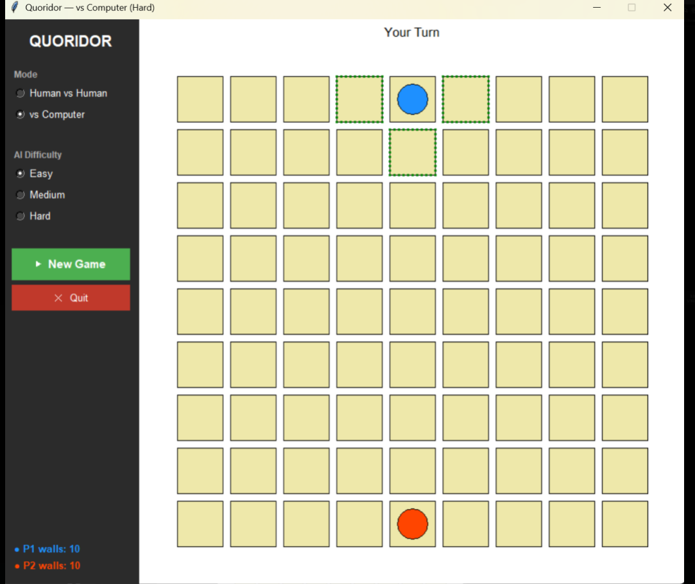
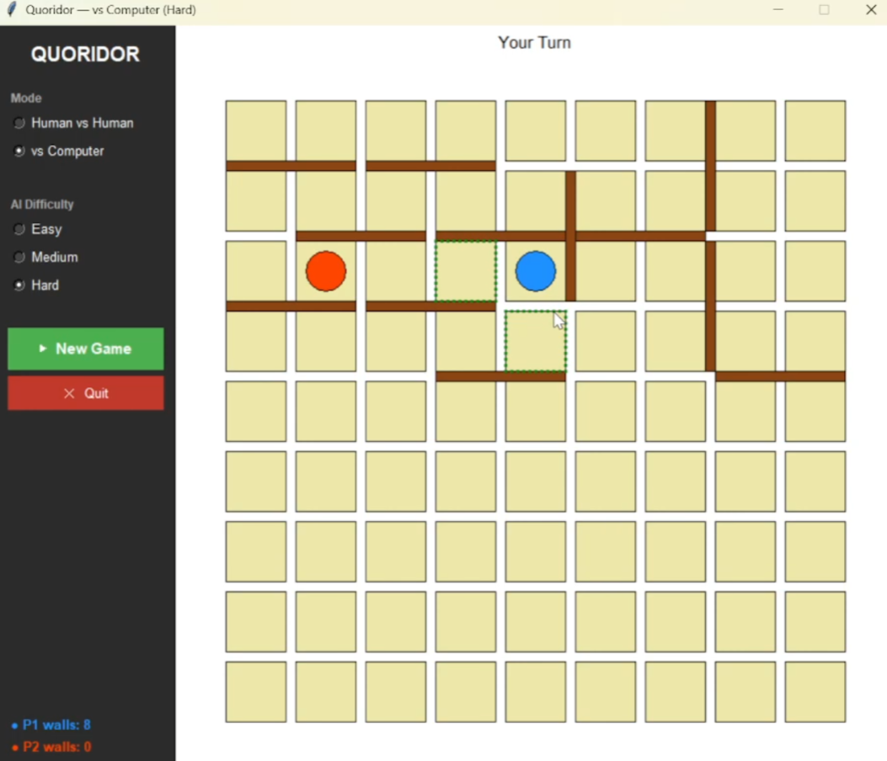
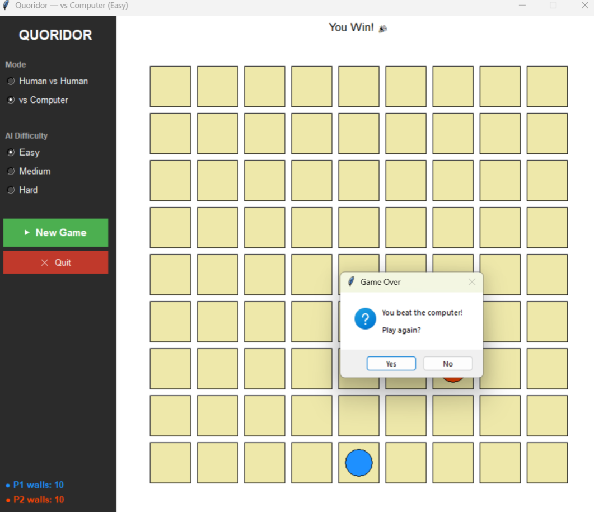

# Quoridor

A fully playable implementation of the classic **Quoridor** board game built with Python and Tkinter. Supports two game modes: **Human vs Human** and **Human vs Computer** with three AI difficulty levels.

---

## Game Description

Quoridor is a two-player abstract strategy game played on a **9×9 grid**. Each player controls a pawn starting on opposite sides of the board. The goal is to be the first to reach the opposite side.

On every turn a player may **either**:
- **Move their pawn** one step orthogonally (or jump over the opponent under special conditions), **or**
- **Place a wall** segment to block the opponent — but a wall can never completely cut off a player's route to their goal.

**Rules at a glance:**
- Each player starts with **10 walls**.
- Walls span **two cells** and sit in the gaps between them.
- A wall is **illegal** if it leaves either player with no path to their goal row.
- When pawns are adjacent, the moving player may **jump straight over** the opponent. If a wall blocks the straight jump, **diagonal jumps** are allowed instead.
- **Player 1 (Blue)** — starts top-center, must reach **row 8** (bottom edge).
- **Player 2 (Orange / AI)** — starts bottom-center, must reach **row 0** (top edge).

### Game Modes

| Mode | Description |
|---|---|
| **Human vs Human** | Two players share one screen and mouse, taking turns |
| **Human vs Computer** | Play against the AI at Easy, Medium, or Hard difficulty |

### AI Difficulty Levels

| Level | Behaviour |
|---|---|
| **Easy** | Picks a random valid move |
| **Medium** | Greedy — picks the pawn move that minimises its own BFS distance to goal |
| **Hard** | Greedy 1-ply over both pawn moves and nearby wall placements, scored by path-length advantage |

---

## Screenshots




---

## Installation & Running Instructions

### Prerequisites

| Requirement | Notes |
|---|---|
| **Python 3.8+** | [python.org/downloads](https://www.python.org/downloads/) |
| **Tkinter** | Bundled with Python on Windows/macOS; on Linux run `sudo apt install python3-tk` |

No third-party packages are needed.

### Steps

```bash
# 1. Clone the repository
git clone https://github.com/your-username/quoridor.git
cd quoridor

# 2. (Optional) Create and activate a virtual environment
python -m venv venv
source venv/bin/activate        # macOS / Linux
venv\Scripts\activate.bat       # Windows

# 3. Run the game
python main.py
```

The game window opens immediately. Select a mode and difficulty in the left sidebar, then click **▶ New Game** to start.

---

## Controls

| Action | How |
|---|---|
| **Move pawn** | Left-click any cell highlighted with a green dashed border |
| **Place a wall** | Left-click in the gap between cells (horizontal or vertical) |
| **Preview a wall** | Hover over a gap — a semi-transparent preview appears |
| **Select mode / difficulty** | Use the radio buttons in the left sidebar |
| **New game** | Click **▶ New Game** in the sidebar |
| **Quit** | Click **✕ Quit** in the sidebar or close the window |

> **Note:** In Human vs Computer mode, input is locked while the AI is thinking. The status bar shows "Computer is thinking…" during this time.

---

## Project Structure

```
quoridor/
├── main.py          # Entry point — launches Tkinter window
├── gui.py           # Sidebar, canvas rendering, click/hover, AI thread management
├── game.py          # Turn logic, pawn movement, wall placement rules
├── board.py         # Wall storage, collision detection, adjacency graph
├── player.py        # Player state — position, walls remaining, win condition
├── ai.py            # AIAgent — Easy / Medium / Hard difficulty implementations
├── pathfinding.py   # BFS path existence and distance used by game and AI
└── utils.py         # Constants, enums (Orientation, Direction), coordinate helpers
```

---

## Demo Video

https://drive.google.com/drive/folders/1186p01Y3sg7VJZplKMg6loqccuEWIYig?usp=sharing
